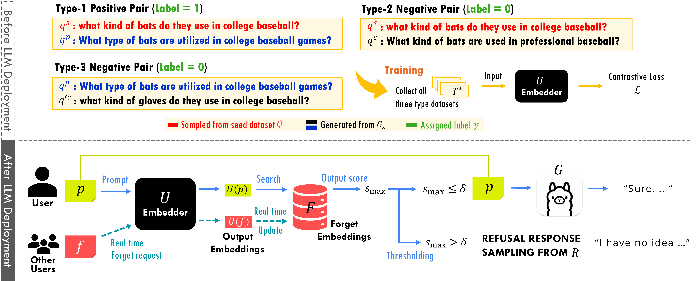

# CURaTE: Continual Unlearning in Real Time with Ensured Preservation of LLM Knowledge

**Seyun Bae, Seokhan Lee, Eunho Yang**

  
  

  

**CURaTE**, the first unlearning method for large language models enabling continual unlearning in real time while also maintaining near perfect preservation of existing knowledge.

## Setup

### 1. Create a new conda environment
Create a fresh conda environment and install the required packages from `requirements.txt`.

### 2. Download the base model
Run `download_model.py` to download the model into a local directory.

## Training

### Unlearning Sentence Embedding Model
To train the sentence embedding model used for unlearning, run: `python train_sentemb.py`

## DB Construction for Continual Unlearning

After training the unlearning sentence embedding model, the scripts in `DB_files/` are used to prepare the *forget set* embedding database for continual unlearning evaluation.

Given the trained unlearning sentence embedder, these scripts construct the cumulative *forget set* for each stage of the continual setting and encode the corresponding samples into the embedding space. They also precompute cosine similarity mappings between the *forget set* embeddings and samples from the *retain set* or other *utility* evaluation datasets.

## Evaluation

### TOFU
To evaluate CURaTE on the TOFU dataset:

1. Update the path in `get_available_cache_dir()` inside `TOFU/evaluate_tofu_sentemb.py`
2. Run the evaluation: `python TOFU/evaluate_tofu_sentemb.py`

### TruthfulQA
To evaluate CURaTE on the TruthfulQA benchmark:

1. Update the path in `get_available_cache_dir()` inside `truthfulQA/truthfulQA_evaluation_sentemb.py`
2. Run the TruthfulQA evaluation: `python truthfulQA/truthfulQA_evaluation_sentemb.py`
3. Run the CommonsenseQA evaluation to measure general knowledge preservation: `python commonsense/evaluation_commonsenseQA_sentemb.py`

### RETURN
To evaluate CURaTE on the RETURN dataset:

1. Update the path in `get_available_cache_dir()` inside `RETURN/evaluate_return_sentemb.py`
2. Run the evaluation: `python RETURN/evaluate_return_sentemb.py`

### ScienceQA
To evaluate CURaTE on the ScienceQA dataset:

1. Update the path in `get_available_cache_dir()` inside `ScienceQA/evaluate_return_sentemb.py`
2. Run the evaluation: `python ScienceQA/evaluate_return_sentemb.py`

## Ablation Study

To reproduce the ablation experiments:

1. Train each baseline model with each ablation dataset: `python train_sentemb.py`
2. Run the scripts in `DB_files/` to generate mapping files for each ablation setting
3. Run the evaluation scripts with `no_gen.py` to obtain Precision, Recall, and F1 scores for each ablation
